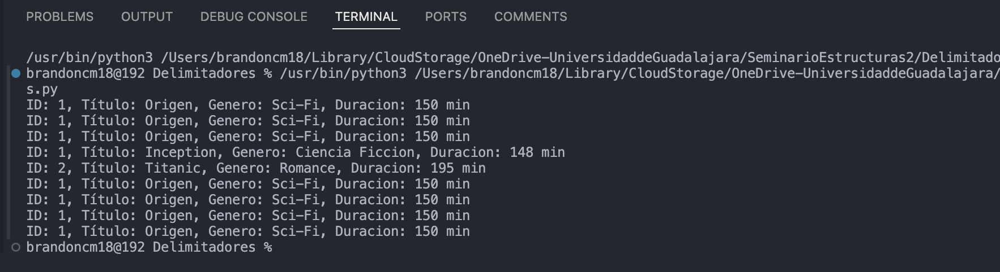
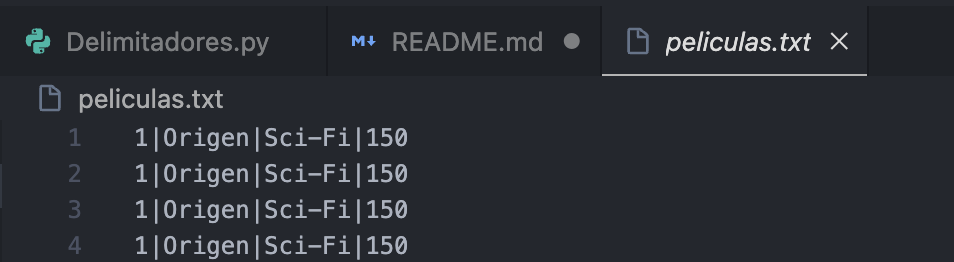

# Sistema de Gestión de Películas

## Descripción
Este proyecto implementa un sistema de gestión de películas utilizando archivos con registros de longitud variable, delimitados por `|`. Se pueden realizar operaciones como agregar, buscar, modificar, eliminar e imprimir películas almacenadas en un archivo de texto.

## Requisitos
- Python 
- Un entorno de ejecución compatible con Python

## Instalación y Ejecución
1. Clona el repositorio o descarga los archivos.
   ```bash
   git clone https://github.com/BrandonCM18/Delimitadores.git
   cd Delimitadores
   ```
2. Ejecuta el programa en Python.
   ```bash
   python gestion_peliculas.py
   ```

## Funcionalidades
### 📌 Agregar Película
Se pueden agregar nuevas películas al archivo de almacenamiento.

### 📌 Imprimir Películas
Muestra todas las películas almacenadas en el archivo `peliculas.txt`.

### 📌 Buscar Película por ID
Permite buscar un registro específico mediante su identificador único.

### 📌 Modificar Película
Actualiza los datos de una película existente.

### 📌 Eliminar Película
Elimina un registro específico del archivo sin afectar los demás datos.

## Capturas de Pantalla
### 📍 Ejecución del Programa


### 📍 Archivo `peliculas.txt` después de agregar registros



## Autor
Axel Brandon Chavez Medrano

